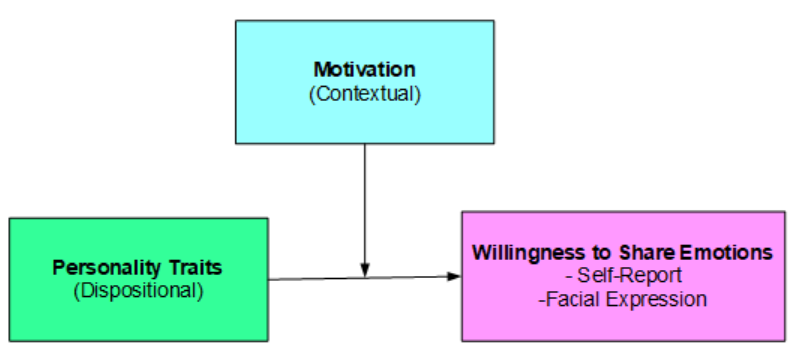
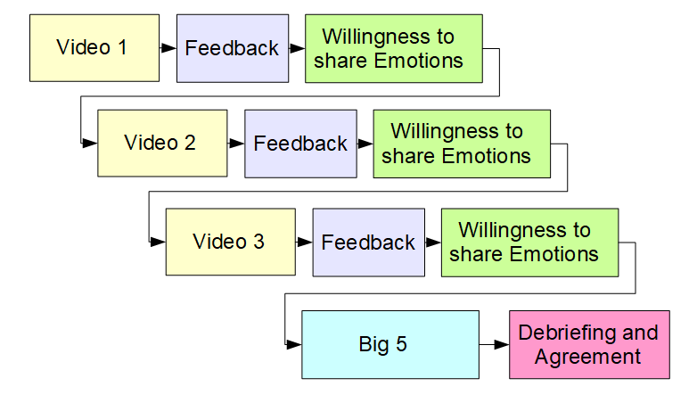
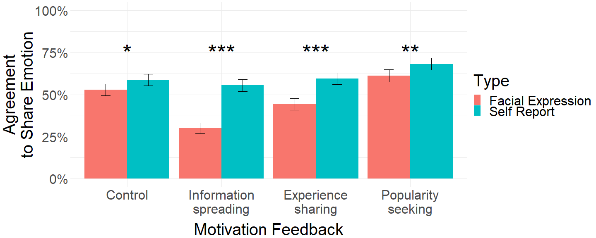
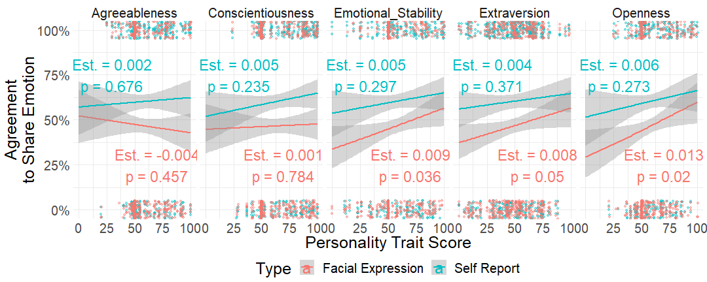
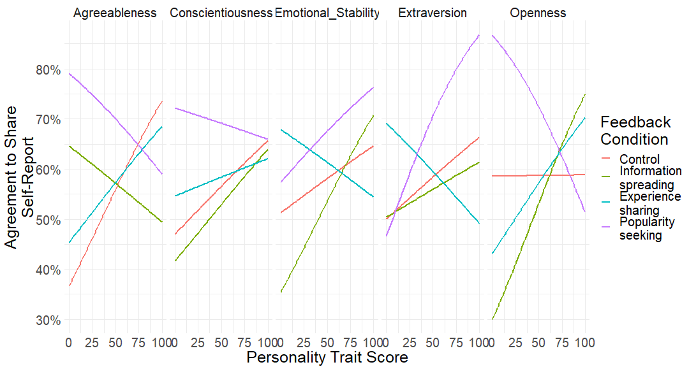
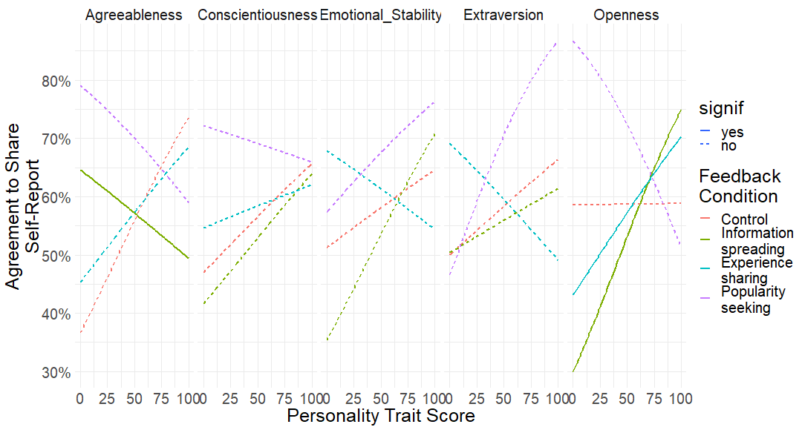
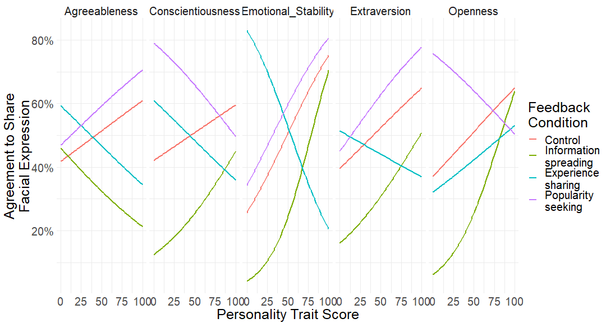
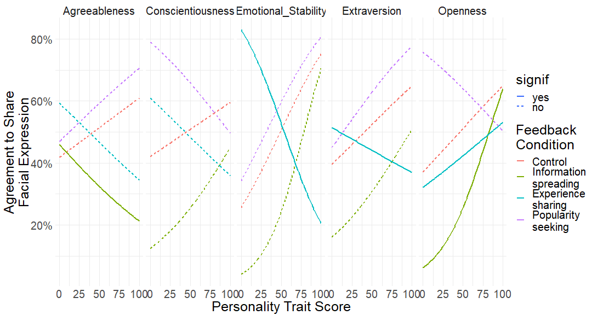
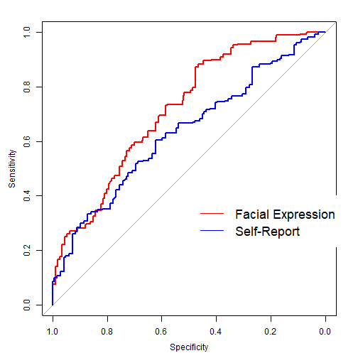

<style>

.reveal h1, .reveal h2, .reveal h3 {
  word-wrap: normal;
  -moz-hyphens: none;
}

.reveal h1 { 
  font-size: 2em; 
}

.reveal pre code {
  font-size: 1em;
}

.footer {
    color: black; background: #E8E8E8;
    position: fixed; top: 90%;
    text-align:center; width:100%;
}

.midcenter {
    position: fixed;
    top: 50%;
    left: 50%;
}

img  {
    box-shadow: none !important;
}

</style>


Willingness to Share Emotion Information on Social Media
========================================================
author: Influence of Personality and Social Context
autosize: true
Damien Dupre, University College Dublin<br>
Gary McKeown and Nicole Andelic, Queen's University Belfast<br>
Gawain Morrison, Sensum Ltd.
<div class="footer" style="margin-top:-50px;font-size:80%;">
IEEE International Conference on Data Science and Advanced Analytics (DSAA) <br>
SeCredISData - Sentiment, Emotion, and Credibility of Information in Social Data <br>
October 4th, 2018 - Turin, Italy
</div>


People Sharing Content on Social Media
========================================================
incremental: true

People are sharing **two types** of content:

1. Informations
<blockquote class="twitter-tweet" data-lang="de"><p lang="en" dir="ltr">[...] I think that would qualify as not smart, but genius....and a very stable genius at that!</p>&mdash; Donald J. Trump (@realDonaldTrump) <a href="https://twitter.com/realDonaldTrump/status/949619270631256064">06. Jan. 2018</a></blockquote>
2. Emotions
<blockquote class="twitter-tweet" data-lang="de"><p lang="en" dir="ltr">[...]NEVER, EVER THREATEN THE UNITED STATES AGAIN OR YOU WILL SUFFER CONSEQUENCES THE LIKES OF WHICH FEW THROUGHOUT HISTORY HAVE EVER SUFFERED BEFORE.[...]</p>&mdash; Donald J. Trump (@realDonaldTrump) <a href="https://twitter.com/realdonaldtrump/status/1021234525626609666">23. Jul. 2018</a></blockquote>

What is an emotion?
========================================================

An emotion is the result of **internal** and **external** modifications triggered by an "**event**"  (Tcherkassof, 2008).

Seven characteristics distinguish Emotions to other cognitive states:
- Event focus
- Appraisal driven
- Response synchronization
- Rapidity of change
- Intensity
- Duration
- Physiological and behavioral impact

Expressing emotions on Social Media
========================================================

People can actively express emotions in social media by sharing texts, emojis, and medias (images, sounds or videos).

However with the wild spread of front facing cameras it is now possible to share emotions by analysing people's facial expressions.

<div class="footer" style="margin-top:-100px;font-weight:bold;">
In our research we are interested in evaluating if people are ready to share their emotions throught their facial expressions and what can influence their willingness to share these informations.
</div>

Factors influencing the willingness to share emotion information (1)
========================================================

**Personality traits** play an important role not only in the way people are expressing emotion (Wache et al., 2015) but also in the way people share them (Dhir et al., 2016). 

According to the Big 5 model, personalities can be distingused by 5 strable traits:
- Openness (degree of intellectual curiosity and creativity),
- Conscientiousness (tendency to be efficient and organized),
- Extroversion (tendency to seek new and strong stimuli),
- Agreeableness (tendency to be compassionate and cooperative),
- Neuroticism (individual's "emotional stability").

Factors influencing the willingness to share emotion information (2)
========================================================

**Motivation to use Social Medias** can also influence people's willingness to share emotions.

Ujhelyi and Szabo (2014) have identified four types of motivations that underpin sharing behaviours:
- Experience sharing (sharing interesting/important facts and being the first to share it),
- Positive self-presentation and popularity seeking (sharing valorised events or having positive reactions),
- Information spreading (sharing relevant information).
- Reducing loneliness and boredom (not investigated in this research)

Hypotheses
========================================================


* Effect of personality traits on willingness to share emotions
* Effect of motivation on willingness to share emotions
* Interaction effect between personality and motivation on willingness to share emotions

Experiment Method
========================================================
type: section

Experiment Design
========================================================


Participants were asked if they were willing to share their **self-reported emotion** as well as their **facial expression** on social media with **Yes/No answers**.

Experiment Method
========================================================

197 participants were recruited via online survey platforms (93 males, 97 females, age M = 44.9, SD = 14.7).

After each video, a feedback was given to the participants to increase their motivation to share their emotion:

1. **No feedback**
2. **Information Spreading** (e.g. "Your emotion was XX%")
3. **Experience Sharing** (e.g. "X persons already shared their emotions")
4. **Popularity Seeking** (e.g. "The average emotion felt by previous people is XX%. Yours is XX%")

Results
========================================================
type: section

Effect of Feedback on Emotion Sharing
========================================================


- Self-Report easier to share than Facial Expression
- No effect of feedback on self-report but ...
- The willingness to share facial expression is negatively/positively influenced by feedback 

Effect of Personality on Emotion Sharing
========================================================



- Most of them are non significant, but...
- Effect of Emo. Stability, Extraversion and Openness on Willingness to share facial expressions

Combining Personality and Motivation in a Multilevel Model
========================================================

Necessity to fit data in a Generalized Linear Mixed Models (GLMM) which incorporates both fixed-effects parameters and random effects in a linear predictor.


```r
MASS::glmmPQL(data = df_raw,
              fixed = share_sr ~ 
                sessid * Extraversion + 
                sessid * Agreeableness + 
                sessid * Conscientiousness + 
                sessid * Emotional_Stability + 
                sessid * Openness,
              random = ~ 1 | task,
              family = binomial)

MASS::glmmPQL(data = df_raw,
              fixed = share_fe ~ 
                sessid * Extraversion + 
                sessid * Agreeableness + 
                sessid * Conscientiousness + 
                sessid * Emotional_Stability + 
                sessid * Openness,
              random = ~ 1 | task,
              family = binomial)
```


Personality x Motivation for Self Report
========================================================



Personality x Motivation for Self Report
========================================================
transition: none



Personality x Motivation for Facial Expression
========================================================



Personality x Motivation for Facial Expression
========================================================
transition: none



Model Accuracy
========================================================
left: 50%


***
AUC for Facial Expression model is **0.72** whereas AUC for Self-Report model is **0.63**.

Prediction more accurate in a GLMM with **random effect** and taking into account not only contextual and dispositional variables but also their **interactions as fixed effects**.

Conclusion
========================================================

(too?) many limits of the procedure:
- only willigness not behavior
- effectiveness validation of the motivation feedback
- little difference between the videos (order effect?)

But a very interesting approach **mixing dispositional factors (personality) and contextual factors (motivation)** to evaluate social media users activity.

Thanks for your attention!
========================================================
type: section
**Willingness to Share Emotion Information on Social Media:**
**Influence of Personality and Social Context**

Damien Dupre, University College Dublin<br>
Gary McKeown and Nicole Andelic, Queen's University Belfast<br>
Gawain Morrison, Sensum Ltd.

<script src="https://ajax.googleapis.com/ajax/libs/jquery/3.1.1/jquery.min.js"></script>
<script>

for(i=0;i<$("section").length;i++) {
if(i==0) continue
$("section").eq(i).append("<p style='font-size:medium;position:fixed;right:10px;bottom:10px;'>" + i + "</p>")
}

</script>
